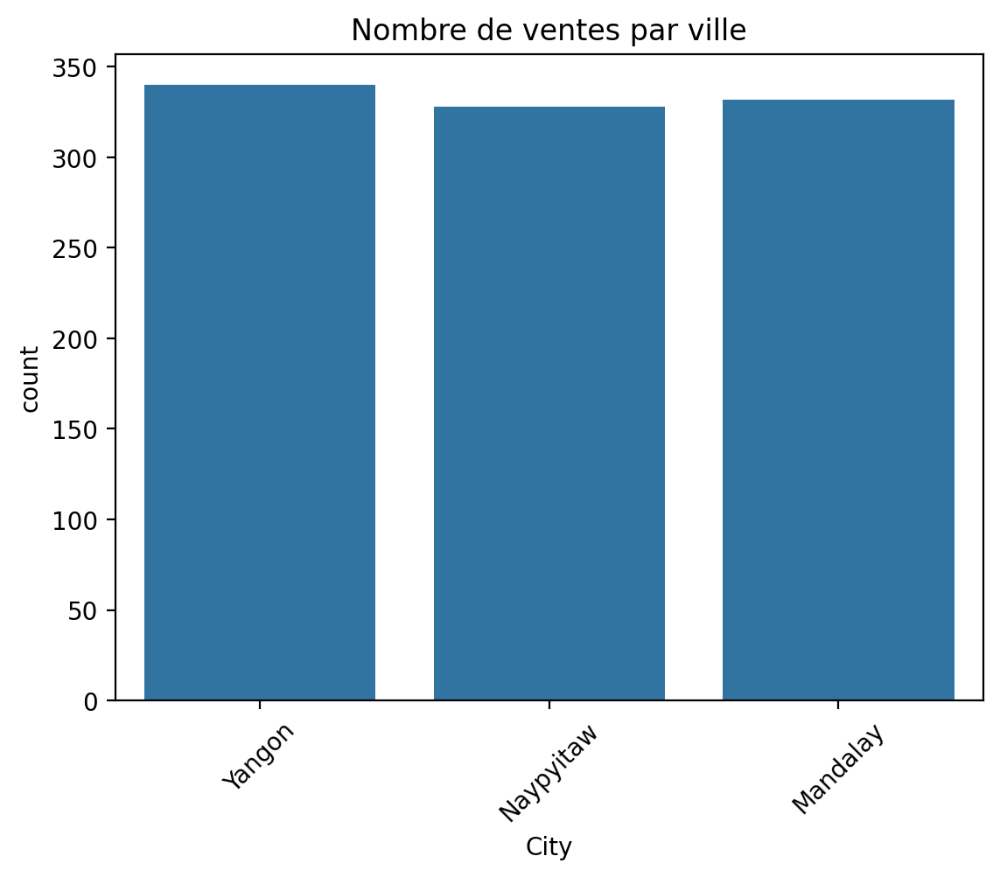
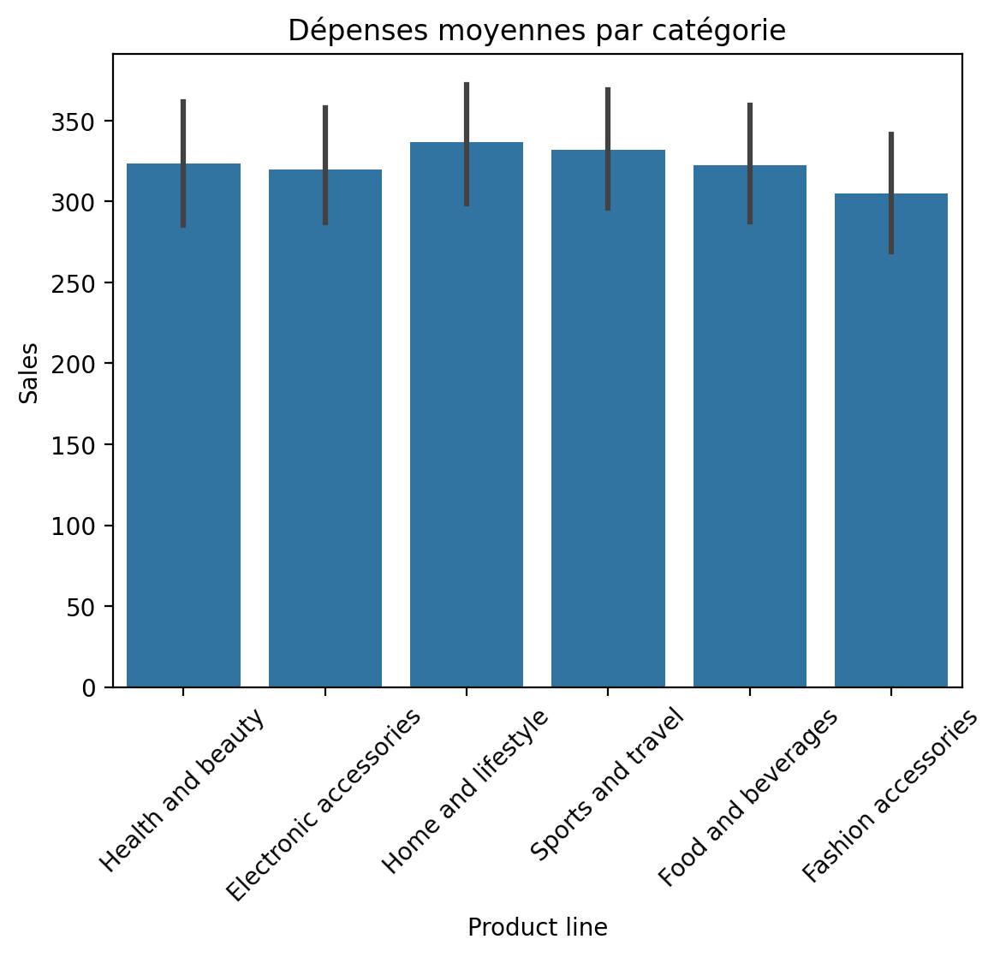
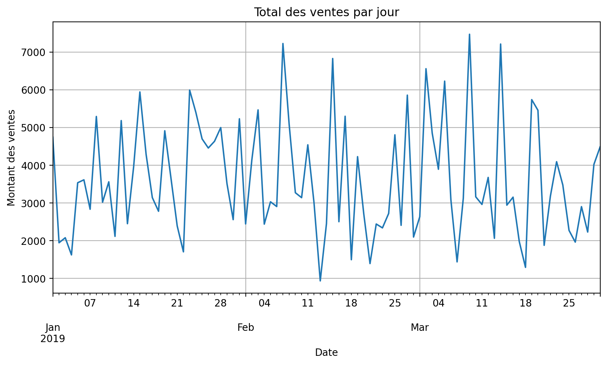
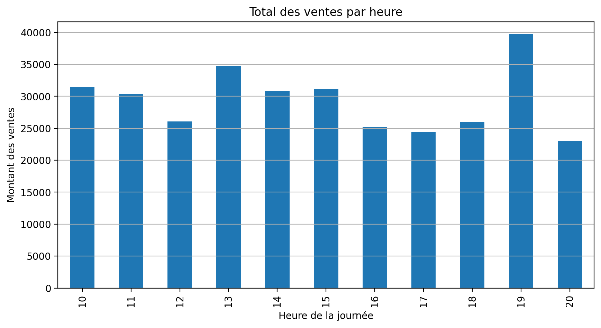

# 🛒 Supermarket Sales Analysis

Projet personnel de Data Science — Analyse exploratoire de données de ventes d’un supermarché.

---

## 🎯 Objectif

Analyser les ventes d’un supermarché à partir d’un jeu de données public pour :  
- Identifier les tendances et comportements d’achat  
- Comprendre la répartition des ventes par produit, branche, ville et heure  
- Détecter les profils clients et leurs habitudes  
- Extraire des insights exploitables pour améliorer la gestion et le chiffre d’affaires
  
---

## 📊 Données

- Source : [Kaggle – Supermarket Sales Dataset](https://www.kaggle.com/datasets/aungpyaeap/supermarket-sales)
- Format : CSV
- Contenu : 
  - Date et heure d’achat
  - Produit, catégorie, prix unitaire
  - Mode de paiement, évaluation client
  - Villes, branches, etc.

---

## 🛠️ Outils utilisés

- Python 3
- Pandas, NumPy
- Matplotlib, Seaborn
- Jupyter Notebook

---

## 📂 Arborescence prévue 

supermarket-sales-analysis/
│
├── README.md # Ce fichier
├── data/
│ └── supermarket_sales.csv # Dataset brut
├── notebooks/
│ └── SuperMarketAnalysis.ipynb # Notebook complet avec analyses
├── scripts/
│ └── analyse.py # Script Python simple
├── images/ # Graphiques exportés pour README
│ ├── sales_by_city.png
│ ├── sales_by_category.png
│ └── sales_by_hour.png
└── requirements.txt # Librairies nécessaires


---

## 🔎 Analyses réalisées
1. **Statistiques descriptives**  
   - Aperçu des données, types, valeurs manquantes  
   - Moyenne, min, max, quantiles  

2. **Répartition des ventes**  
   - Par ville  
   - Par produit / catégorie  
   - Par branche  

3. **Analyse temporelle**  
   - Ventes par jour  
   - Ventes par heure  
   - Heatmap : ventes par jour de la semaine et heure  

4. **Analyse client**  
   - Par genre  
   - Par mode de paiement  
   - Score moyen des évaluations  

---

## 📊 Exemples de visualisations

### Ventes par ville


### Dépenses moyennes par catégorie


### Ventes par jour


### Ventes par heure


---

## 🚀 Résultats clés
- Certaines villes génèrent significativement plus de ventes  
- Les catégories de produits ne contribuent pas de manière égale au chiffre d’affaires  
- Les ventes ont des pics en fin d’après-midi  
- Différences observables selon le genre et le type de paiement  

---

## 💻 Instructions pour reproduire l’analyse
1. Cloner le repo :  
```bash
git clone https://github.com/MichelTCHATCHOUA/supermarket-sales-analysis.git
pip install -r requirements.txt
